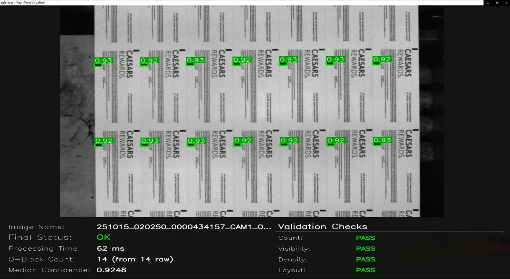
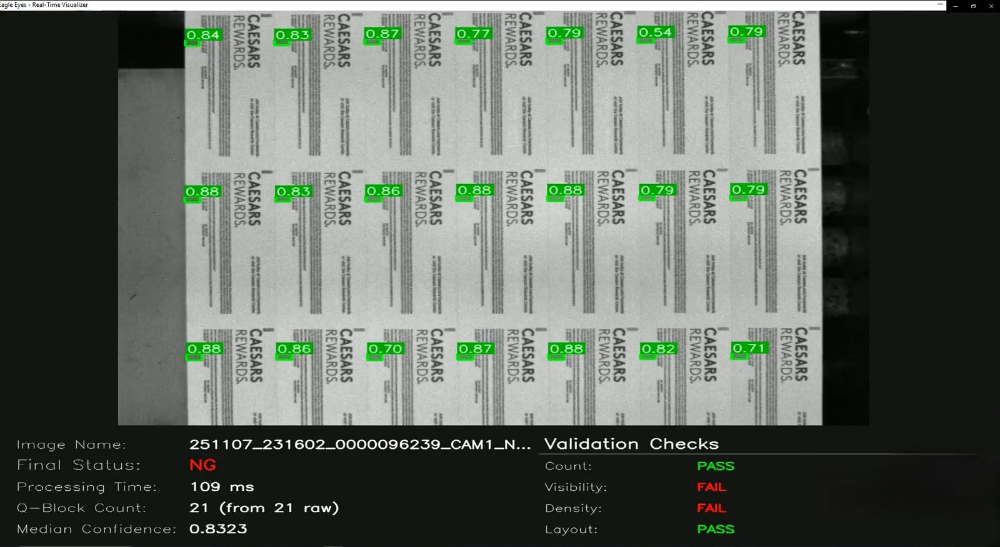

# 🦅 Eagle Eyes - Vision AI for Print Defect Detection

YOLOv8-powered quality inspection for casino payout ticket printing

[](https://www.python.org/)
[](https://docs.ultralytics.com/)
[](https://opencv.org/)
[](https://onnxruntime.ai/)
[](/)

> **Capstone Project - MS Data Science, University at Buffalo**
> Built for **Nissha Medical Technologies** | Team Lead: **Mudit Nautiyal**

---

## What & Why

Casino payout ticket printers produce **~30 million tickets per day** across the industry. A **4% defect rate** means over a million potentially misread tickets daily - leading to revenue disputes, regulatory risk, and customer complaints.

**Eagle Eyes** is an automated visual inspection system that detects **Q-Block alignment markers** on printed tickets and validates print quality through a multi-gate decision pipeline. It replaces manual spot-checking with deterministic, auditable, real-time inspection.

---

## Architecture


```mermaid
flowchart LR
    A["📷 Image Input"] --> B["🔍 YOLO Primary Pass"]
    B --> C{"Count\nMatches?"}
    C -- Yes --> E["🧹 Conservative Dedup"]
    C -- No --> D["🔄 Recovery Pass\n(Low conf + TTA)"]
    D --> E
    E --> F["4-Gate Validation"]
    F --> G["✅ OK / ❌ NG Decision"]
    G --> H["📄 CSV Log +\n📁 Image Routing"]

    subgraph F["4-Gate Validation"]
        direction TB
        F1["Count Gate"]
        F2["Visibility Gate"]
        F3["Density Gate"]
        F4["Layout Gate"]
    end

    style A fill:#1a1a2e,stroke:#e94560,color:#fff
    style B fill:#16213e,stroke:#0f3460,color:#fff
    style D fill:#16213e,stroke:#e94560,color:#fff,stroke-dasharray: 5 5
    style E fill:#0f3460,stroke:#533483,color:#fff
    style G fill:#1a1a2e,stroke:#00C853,color:#fff
    style H fill:#1a1a2e,stroke:#0f3460,color:#fff
    style F1 fill:#533483,stroke:#e94560,color:#fff
    style F2 fill:#533483,stroke:#e94560,color:#fff
    style F3 fill:#533483,stroke:#e94560,color:#fff
    style F4 fill:#533483,stroke:#e94560,color:#fff
```

> See [ARCHITECTURE.md](ARCHITECTURE.md) for a full technical deep-dive on each stage.

---

## Results

Validated on **2,912 images** from an extended production dataset:

| Metric | Value |
| --- | --- |
| **Overall Accuracy** | **99.91%** |
| OK Images (Good) | 222 |
| NG Images (No Good) | 2,690 |
| Total Images Evaluated | 2,912 |
| Avg. Inference Time | ~83 ms/image (GPU) |

---

## Demo

https://github.com/user-attachments/assets/7f7259d9-337a-4dc4-a049-3720be4c7a98

### Dashboard

The real-time OpenCV dashboard shows live annotations, gate results, and decision status:





> 🎥 *Full HD demo video coming soon - recorded on CUDA-enabled workstation*

---

## Tech Stack

| Component | Technology |
| --- | --- |
| Object Detection | Ultralytics YOLOv8 (ONNX export) |
| Image Processing | OpenCV 4.8+ |
| Deep Learning | PyTorch 2.0+ |
| Inference Runtime | ONNX Runtime |
| Scientific Compute | NumPy |
| Language | Python 3.10+ |

---

## Installation

```bash
git clone https://github.com/MuditNautiyal-21/EagleEyes-QBlock-Vision-AI.git
cd EagleEyes-QBlock-Vision-AI
pip install -r requirements.txt
```

> **Note:** Model weights (`.onnx`) are excluded from the repository due to size. Place the trained model at the path specified in `config/rules.json` → `meta.weights_path`.

## Usage

```bash
python app/runner_visualizer.py
```

1. Drop ticket images into `data/incoming/`
2. The dashboard opens automatically — images are evaluated in real time
3. Results are logged to `data/results/visualizer_results.csv`
4. Images are routed to `data/Good_Images/` (OK) or `data/No_Good_Images/` (NG)
5. Press **`q`** to exit

---

## Configuration

All operational thresholds live in [`config/rules.json`](config/rules.json). See [`config/rules_template.json`](config/rules_template.json) for an annotated template with placeholder values.

| Section | Controls |
| --- | --- |
| `count_inference` | Primary & recovery pass parameters (confidence, IoU, TTA, image size) |
| `count_rules` | Expected marker counts and tolerances per layout |
| `visibility_thresholds` | Confidence and area-fraction bounds |
| `density_thresholds` | Grayscale mean and dark-pixel ratio ranges |
| `relative_position` | Spatial constraint parameters |

**Tuning workflow:** Change one threshold group → run a validation pack of known OK/NG images → review the CSV log for `failed_checks` distribution.

---

## Project Structure

```
EagleEyes-QBlock-Vision-AI/
├── app/
│   ├── qblock_engine.py        # Core engine — inference, dedup, 4-gate validation
│   ├── runner_visualizer.py    # Production runner + OpenCV dashboard
│   └── fx_router.py            # Output router (PLC-ready, optional)
├── config/
│   ├── rules.json              # All production thresholds
│   └── rules_template.json     # Annotated config template
├── models/                     # YOLO model weights (gitignored)
├── data/
│   ├── incoming/               # Drop images here
│   ├── Good_Images/            # OK results routed here
│   ├── No_Good_Images/         # NG results routed here
│   └── results/                # CSV audit logs
├── ARCHITECTURE.md             # Technical deep-dive
├── requirements.txt
└── .gitignore
```

---

## Known Limitations

* **YOLO hallucinations** — False positives can increase when the recovery pass is triggered at very low confidence thresholds
* **Ink density sensitivity** — Changes in printer exposure or lighting conditions can shift grayscale/dark-ratio values outside calibrated ranges
* **Single ticket layout** — Currently tuned for specific Q-Block layouts (14 or 21 markers); new layouts require re-calibration

---

## My Role

I served as **Team Lead** for Team Affida (4 members), responsible for:
- Designing the 4-gate validation pipeline architecture
- Building the core detection engine (`qblock_engine.py`) and OpenCV dashboard
- Calibrating inference thresholds to achieve 99.91% accuracy on the production dataset
- Coordinating with Nissha Medical Technologies on acceptance criteria and deployment requirements

---

## Attribution

Built by **Team Affida** as a capstone project for the **MS Data Science** program at the **University at Buffalo**, in collaboration with **Nissha Medical Technologies**.

> [!IMPORTANT]
> This project was developed as part of a university capstone collaboration with Nissha Medical Technologies. Source code is shared for portfolio and educational purposes. For usage permissions, please contact the author.
